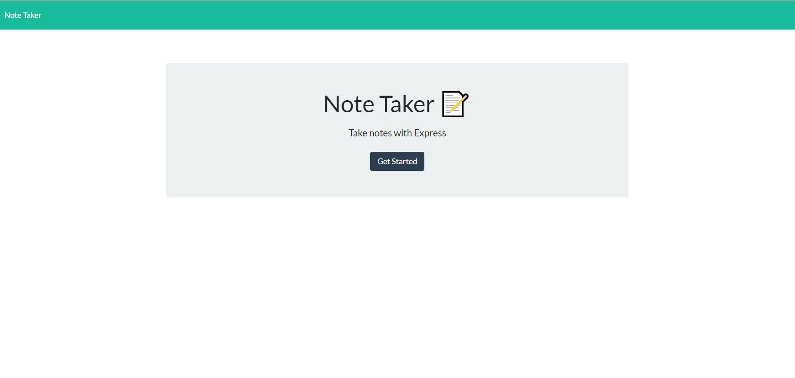

# note-taker

## Description 

This repository is where I developed the "Note Taker" product. Not only do I work on code and issues here, I also publish the latested updates and functions. This source code is available to everyone under the Free Software Foundation, Inc. https//fsf.org/.

## Table of Contents (Optional)

* [Installation](#installation)
* [Usage](#usage)
* [Credits](#credits)
* [License](#license)

## Installation

There are no installation guide as it is a woking web page that you go too.(https://intense-chamber-97241.herokuapp.com/) 

## Usage 

To use the "Note Taker" simply open the link (https://intense-chamber-97241.herokuapp.com/) which will bring you to the home page.
Once you are on the home page click the button to get started, it will bring up the Note Taker page and simply follow the gif below:

## Credits

Developed to spec by Tarmity Flassman, ScreenCast.

## License
  * MIT
 

